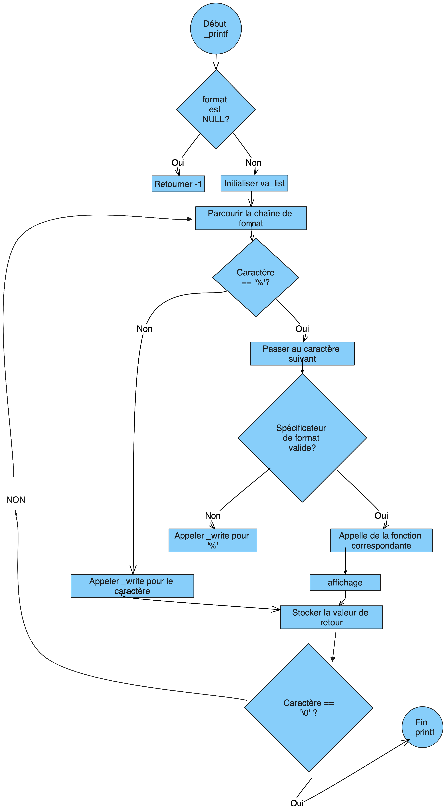

# Projet _printf

## Introduction

Bienvenue dans le projet printf. Cette implémentation de la fonction printf en C vise à reproduire le comportement de la fonction standard printf en gérant une variété de spécificateurs.

Cette version de printf prend en charge plusieurs types de formats, notamment les caractères, les chaînes, et les entiers. Le but est de permettre une utilisation similaire à la fonction standard.

Dans ce projet, nous avons conçu des fonctions pour :

Gérer les spécificateurs de format,

Afficher les valeurs correspondantes à chaque spécificateur,

Implémenter un mécanisme de validation des formats,

Retourner le nombre total de caractères imprimés.

## Description

Le projet _printf consiste à implémenter une version simplifiée de la fonction standard printf en C. Cette version gère plusieurs types de formats d'entrée, notamment les caractères, les chaînes de caractères et les entiers. L'objectif est de créer une fonction qui peut formater et afficher diverses données sur la sortie standard.

## Compilation

Pour compiler le projet, vous pouvez utiliser la commande suivante :

gcc -Wall -Werror -Wextra -pedantic -std=gnu89 -Wno-format *.c

## Fonctionnalités

La fonction _printf implémente plusieurs spécificateurs de format :

%c : Affiche un caractère.

%s : Affiche une chaîne de caractères. Si l'argument est NULL, elle affiche "(NULL)".

%d ou %i : Affiche un entier. La fonction gère les entiers négatifs.

%% : Affiche le caractère %.

## Fichiers du projet
Le projet se compose des fichiers suivants :

main.h : Contient les déclarations des fonctions utilisées dans le projet, ainsi que la structure pour associer les formats aux fonctions correspondantes.

printer.c est un fichier qui contient les fonctions : print_char, print_string, print_int.
Ces fonctions sont utilisées pour afficher un caractère, une chaîne et un entier respectivement.

print_func_format.c, print_validate.c, print_all.c : Ces fichiers contiennent la logique pour valider les formats et gérer les formats dans _printf.

print_func_format.c
execute la fonction en lien avec le specifieur

print_validate.c
ce fichier contient la fonction print_validate. Cette fonction prend le caractere apres le '%' et verifie si elle corresspond à un des specificateurs de format valide de la foction _printf

print_all.c
ce fichier contient la fonction print_all est chargée de parcourir la chaîne de format passée à la fonction _printf et de traiter chaque caractère individuellement. Lorsqu'elle rencontre un spécificateur de format, elle appelle la fonction correspondante pour traiter et afficher l'argument associé à ce format. Elle gère également les autres caractères qui ne sont pas des spécificateurs de format en les imprimant directement.

## Exemple d'utilisation
Voici quelques exemples d'utilisation de la fonction _printf :

pour utilser notre fonction _printf utiliser la bilbliotheque "main.h"

Affichage d'une chaîne de caractères :
```c
{
    _printf("Hello, %s!\n", "World");
}
```
Sortie : Hello, World!

Affichage d''un caractère :
```c

{
    _printf("Character: %c\n", 'A');
}
```

Sortie : Character: A

Affichage d''un entier :
```c
{
    _printf("Integer: %d\n", 42);
}
```
Sortie : Integer: 42

Affichage de % :
```c
{
    _printf("Percent: %%\n");
}
```
Sortie : Percent: %

Flowchart




Auteurs

Ce projet a été développé par :

[Thomas ROUSSEAU](https://github.com/Tomsonne) et [Shakib ROJAS](https://github.com/SR9401).
